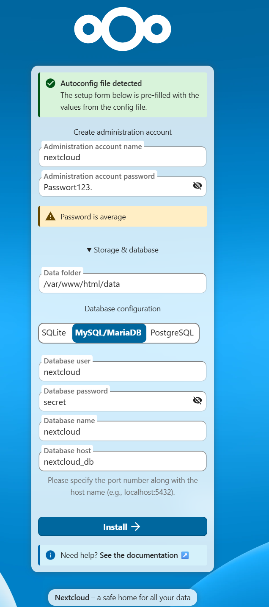
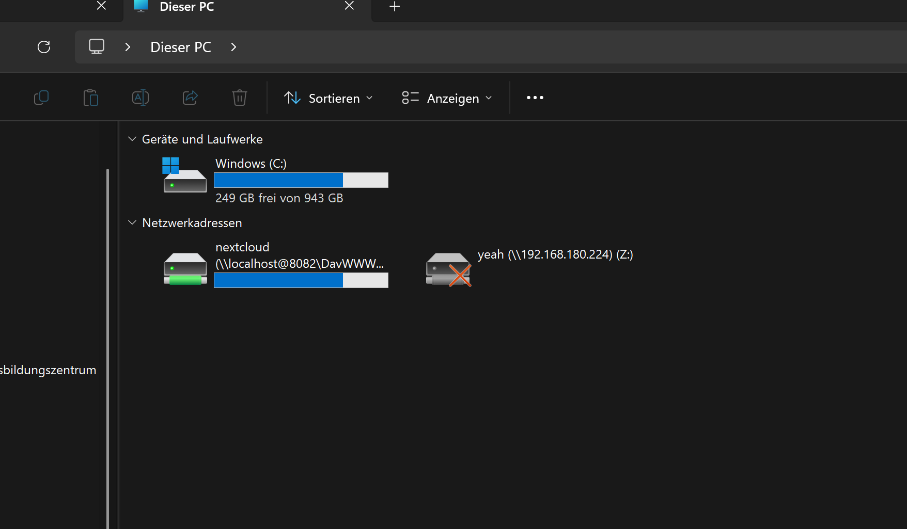
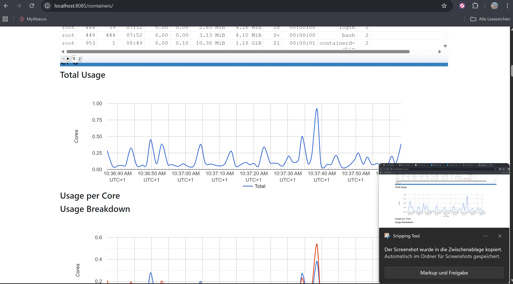

## Projekt – Nextcloud mit Docker

### Docker Netzwerk erstellen

Zuerst wurde ein eigenes Docker-Netzwerk erstellt, damit sich die Container intern erreichen können:

```bash
docker network create nextcloud-net
```

Überprüfung:

```bash
docker network ls
```

Ergebnis:  
Das Netzwerk `nextcloud-net` wurde erfolgreich erstellt.

---

### MariaDB (Datenbank) starten

Die Datenbank wurde im internen Netzwerk gestartet:

```bash
docker run -d --name nextcloud_db --network nextcloud-net -e MYSQL_ROOT_PASSWORD=admin -e MYSQL_DATABASE=nextcloud -e MYSQL_USER=nextcloud -e MYSQL_PASSWORD=secret --restart=always mariadb:latest
```

Status prüfen:

```bash
docker ps
```

Logs prüfen:

```bash
docker logs nextcloud_db
```

Wichtiges Log-Resultat:

```
mariadbd: ready for connections.
```

Die Datenbank wurde korrekt initialisiert und läuft stabil auf Port 3306 (nur intern im Docker-Netzwerk erreichbar).

---

### Nextcloud Container starten

Der Nextcloud-Container wurde mit Verbindung zur MariaDB gestartet:

```bash
docker run -d --name nextcloud --network nextcloud-net -p 8082:80 -e MYSQL_HOST=nextcloud_db -e MYSQL_DATABASE=nextcloud -e MYSQL_USER=nextcloud -e MYSQL_PASSWORD=secret -v nextcloud_data:/var/www/html --restart=always nextcloud:latest
```

Port-Mapping:

| Host-Port | Container-Port |
|-----------|----------------|
| 8082      | 80             |

Zugriff im Browser:

```
http://localhost:8082
```

Nextcloud Screenshot: 


---

### Container Status prüfen

```bash
docker ps
```

Ergebnis:

- `nextcloud` läuft
- `nextcloud_db` läuft

---

### Nextcloud Logs prüfen

```bash
docker logs nextcloud
```

Wichtige Meldung:

```
Initializing finished
Apache configured -- resuming normal operations
```

Nextcloud wurde erfolgreich initialisiert.

---

### WebDAV Vorbereitung

Der Windows-Dienst `WebClient` wurde geprüft:

```powershell
Get-Service WebClient
```

Status:

```
Running
```

WebDAV ist damit grundsätzlich nutzbar.


---

### Monitoring mit cAdvisor

cAdvisor wurde als Monitoring-Container gestartet:

```bash
docker run -d --name cadvisor --restart=always -p 8085:8080 -v /:/rootfs:ro -v /var/run:/var/run:rw -v /sys:/sys:ro -v /var/lib/docker/:/var/lib/docker:ro gcr.io/cadvisor/cadvisor:latest
```

Zugriff im Browser:

```
http://localhost:8085
```

Mit cAdvisor können folgende Werte überwacht werden:

- CPU-Auslastung
- RAM-Verbrauch
- Netzwerktraffic
- Container-Statistiken

---

### Architekturübersicht

Host-System  
→ Docker Engine  
→ Docker Netzwerk `nextcloud-net`  
→ MariaDB Container  
→ Nextcloud Container  
→ Webzugriff über Port 8082  

Monitoring:

→ cAdvisor auf Port 8085



---

### Sicherheitsaspekte

- Die Datenbank ist nicht extern freigegeben (kein Port-Mapping)
- Zugriff erfolgt nur über den Nextcloud-Webserver
- Container laufen isoliert im eigenen Docker-Netzwerk
- Persistente Speicherung erfolgt über Docker Volume

---

### Fazit

Nextcloud wurde erfolgreich containerisiert betrieben.  
Die Architektur ist sauber getrennt (Frontend / Datenbank).  
Durch Docker-Netzwerke und Volumes ist das System isoliert und persistent.  
Mit cAdvisor wurde eine Monitoring-Lösung integriert, um Ressourcenverbrauch und Containerzustand zu überwachen.