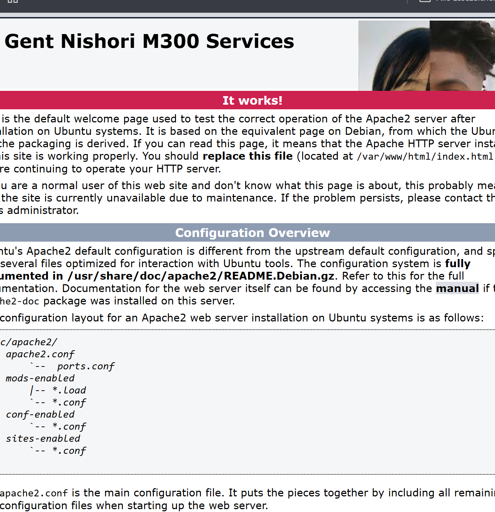

# M300-Services-NIS
Modul 300 von Gent Nishori
<!-- TOC -->

- [M300-Services-NIS](#m300-services-nis)
- [M300 – Toolumgebung einrichten](#m300--toolumgebung-einrichten)
  - [Ziel](#ziel)
  - [Verwendete Tools](#verwendete-tools)
  - [Einrichtung der Toolumgebung](#einrichtung-der-toolumgebung)
    - [Git \& GitHub](#git--github)
    - [VirtualBox](#virtualbox)
    - [Vagrant](#vagrant)
- [M300 – Fragen \& Antworten](#m300--fragen--antworten)
  - [Cloud Computing](#cloud-computing)
    - [Was versteht man unter Cloud-Computing?](#was-versteht-man-unter-cloud-computing)
    - [Was versteht man unter Infrastructure as a Service (IaaS)?](#was-versteht-man-unter-infrastructure-as-a-service-iaas)
  - [Infrastructure as Code](#infrastructure-as-code)
    - [Was ist der Unterschied zur manuellen Installation einer VM?](#was-ist-der-unterschied-zur-manuellen-installation-einer-vm)
    - [Vagrant](#vagrant-1)
  - [Was wird mit Vagrant erzeugt?](#was-wird-mit-vagrant-erzeugt)
  - [Welche Aussagen treffen zu?](#welche-aussagen-treffen-zu)
  - [In welchen Bereich des Cloud-Computings ist Vagrant einzuordnen?](#in-welchen-bereich-des-cloud-computings-ist-vagrant-einzuordnen)
  - [Welche Alternativen zu Vagrant bestehen?](#welche-alternativen-zu-vagrant-bestehen)
  - [Wo speichert Vagrant seine Konfiguration?](#wo-speichert-vagrant-seine-konfiguration)
  - [Was bedeutet die Fehlermeldung](#was-bedeutet-die-fehlermeldung)
    - [Bei welcher LPI-Zertifizierung nützt mir das Vagrant-Wissen?](#bei-welcher-lpi-zertifizierung-nützt-mir-das-vagrant-wissen)
  - [LB2 – Neue VM erstellen und Umgebung vorbereiten](#lb2--neue-vm-erstellen-und-umgebung-vorbereiten)
    - [1) Neue VM erstellen](#1-neue-vm-erstellen)

<!-- /TOC -->

# M300 – Toolumgebung einrichten  
**Name:** Gent Nishori  
**Modul:** M300 – Infrastruktur automatisieren  
**Datum:** 09.02.2026  

---

## Ziel
Ziel dieser Arbeit ist der Aufbau einer lokalen Toolumgebung, mit der virtuelle Maschinen
automatisiert und reproduzierbar erstellt werden können.  
Dies bildet die Grundlage für *Infrastructure as Code (IaC)*.

---

## Verwendete Tools
- **Git / GitHub** – Versionsverwaltung und Ablage der Dokumentation
- **VirtualBox** – Lokaler Hypervisor für virtuelle Maschinen
- **Vagrant** – Automatisierte Erstellung und Verwaltung von VMs
- **Ubuntu 16.04 (xenial64)** – Linux Betriebssystem
- **Apache2** – Webserver
- **Visual Studio Code** – Editor für Markdown und Konfigurationsdateien

---

## Einrichtung der Toolumgebung

### Git & GitHub
Zuerst wurde ein GitHub-Repository erstellt.  
Auf dem lokalen System wurde Git installiert und mit dem eigenen GitHub-Account konfiguriert.
Die Authentifizierung erfolgt mittels SSH-Key.

---

### VirtualBox
VirtualBox wurde als Virtualisierungssoftware installiert.  
Sie dient als Provider für Vagrant.

---

### Vagrant
Für die VM wurde ein neues Verzeichnis erstellt und eine Vagrant-Umgebung initialisiert:

```bash
vagrant init ubuntu/xenial64
vagrant up
```


Anschliessend wurde per SSH eine Verbindung zur VM aufgebaut:
`vagrant ssh`


Probleme und Lösungen
Beim ersten Start der VM trat ein Boot-Problem auf.
Nach einem Neustart der VM konnte das System korrekt gestartet werden.

Nach ein bisschen Recherche, wurde es ausgefunden das dieses Problem ist bekannt bei älteren Ubuntu-Versionen in Kombination mit aktueller
VirtualBox-Version.

Apache Webserver
Innerhalb der VM wurde der Apache Webserver installiert:

```bash
sudo apt-get update
sudo apt-get install -y apache2
```

Der Webserver wurde erfolgreich getestet.
Webzugriff vom Host
Mittels Portweiterleitung im Vagrantfile wurde der Webserver vom Host-System erreichbar gemacht:

config.vm.network "forwarded_port", guest: 80, host: 8080
Der Zugriff erfolgte über:

http://localhost:8080
Eigene Webseite
Die Standardseite von Apache wurde angepasst.

Pfad:
/var/www/html/index.html




Fazit
Die Toolumgebung ermöglicht es, virtuelle Maschinen schnell und reproduzierbar zu erstellen.
Durch Vagrant entfällt die manuelle Konfiguration über grafische Oberflächen.
Dies entspricht dem Prinzip von Infrastructure as Code und bildet die Basis für weitere
Automatisierungsschritte im Modul M300.


# M300 – Fragen & Antworten

## Cloud Computing

### Was versteht man unter Cloud-Computing?
Cloud Computing bezeichnet die Nutzung von IT-Ressourcen wie Programme, Speicher und Rechenleistung über ein Netzwerk (z.B. Internet), ohne dass diese lokal installiert sein müssen.

---

### Was versteht man unter Infrastructure as a Service (IaaS)?
IaaS stellt grundlegende IT-Infrastruktur wie virtuelle Maschinen, Speicher und Netzwerke zur Verfügung. Der Benutzer verwaltet Betriebssystem und Software selbst.

---

## Infrastructure as Code

### Was ist der Unterschied zur manuellen Installation einer VM?
Infrastructure as Code ermöglicht eine automatisierte, reproduzierbare und dokumentierte Erstellung von virtuellen Maschinen, im Gegensatz zur manuellen Installation über eine grafische Oberfläche.

---

### Vagrant

## Was wird mit Vagrant erzeugt?
Mit Vagrant werden virtuelle Maschinen erstellt und verwaltet.

---

## Welche Aussagen treffen zu?
Richtig ist:  
**b** Vagrant erzeugt virtuelle Maschinen und unterstützt verschiedene Hypervisoren und Cloud-Umgebungen.

---

## In welchen Bereich des Cloud-Computings ist Vagrant einzuordnen?
Vagrant ist dem Bereich **Infrastructure as a Service (IaaS)** zuzuordnen.

---

## Welche Alternativen zu Vagrant bestehen?
Mögliche Alternativen sind z.B. Terraform, Docker, Packer oder direkte VirtualBox-Konfigurationen.

---

## Wo speichert Vagrant seine Konfiguration?
Die Konfiguration wird im **Vagrantfile** gespeichert.

---

## Was bedeutet die Fehlermeldung  
„A Vagrant environment or target machine is required to run this command.“?
Der Befehl wurde in einem Verzeichnis ausgeführt, in dem keine `Vagrantfile` vorhanden ist.

---

### Bei welcher LPI-Zertifizierung nützt mir das Vagrant-Wissen?
Das Wissen ist hilfreich für die **LPI DevOps Tools Engineer** Zertifizierung.

---


## LB2 – Neue VM erstellen und Umgebung vorbereiten 

**Ziel:**  
Eine neue Test-VM mit Vagrant erstellen, um Serverdienste (Apache + Webalizer) zuerst manuell zu testen und danach zu automatisieren.

---

### 1) Neue VM erstellen
Im Arbeitsverzeichnis wurde ein neues VM-Verzeichnis erstellt und eine Vagrant-Umgebung initialisiert:

```bash
cd myM300/
mkdir myVM
cd myVM
vagrant init ubuntu/xenial64
vagrant up --provider virtualbox
```
2) Verbindung zur VM (SSH)
Nach dem Start wurde die VM via SSH betreten:

`vagrant ssh`


3) Webserver vom Host erreichbar machen (Port Forwarding)
Damit der Apache-Webserver aus der VM im Browser auf dem Host erreichbar ist, wurde im Vagrantfile eine Portweiterleitung eingerichtet:

config.vm.network "forwarded_port", guest: 80, host: 8081, auto_correct: true
Hinweis:
Standardmässig wird oft host: 8080 verwendet. Bei mir war der Port 8080 bereits belegt, deshalb wurde 8081 gewählt.

4) Portweiterleitung aktivieren
Nach der Änderung am Vagrantfile wurde die VM neu geladen, damit die Portweiterleitung übernommen wird:

vagrant reload
Anschliessend wurden die weitergeleiteten Ports geprüft:

vagrant port
Erwartetes Resultat (Beispiel):

80 (guest) => 8081 (host)

5) Zugriffstest im Browser
Der Webserver kann nun über den Host-Browser getestet werden:

Apache:
http://localhost:8081

Webalizer (später nach Installation):
http://localhost:8081/webalizer/

Problem / Lösung
Problem: Port 8080 war auf dem Host bereits besetzt → Webseite nicht erreichbar.
Lösung: Port im Vagrantfile auf 8081 geändert und VM mit vagrant reload neu geladen.

 

