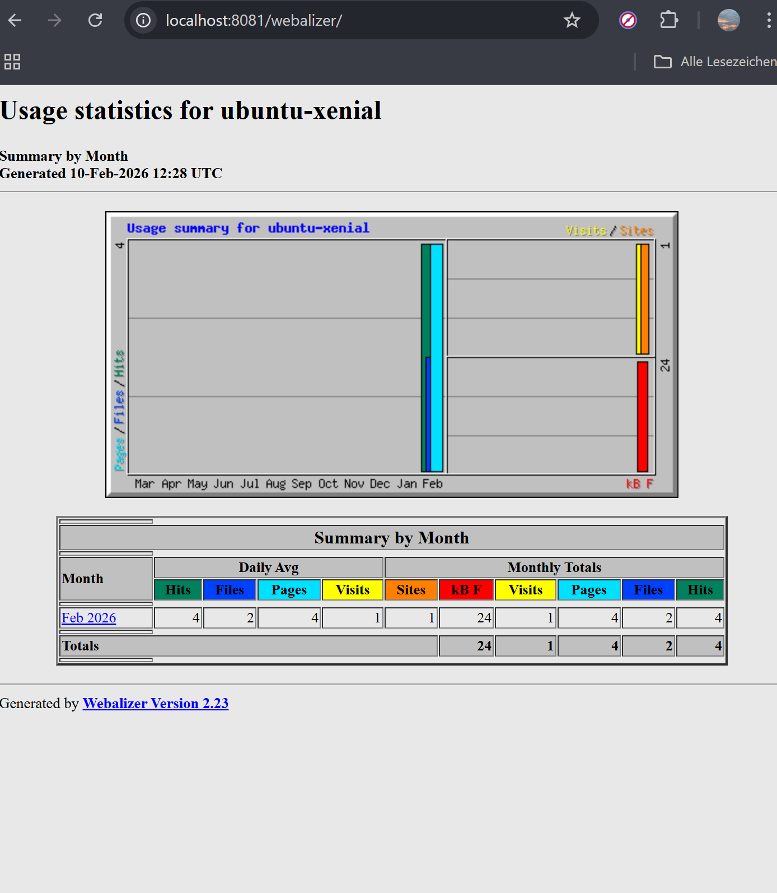
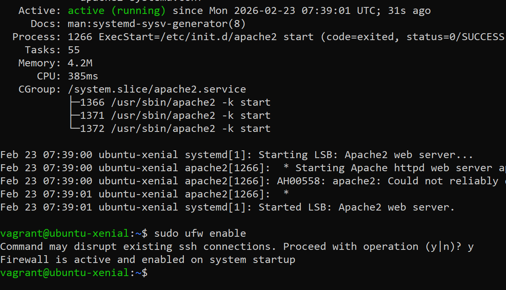
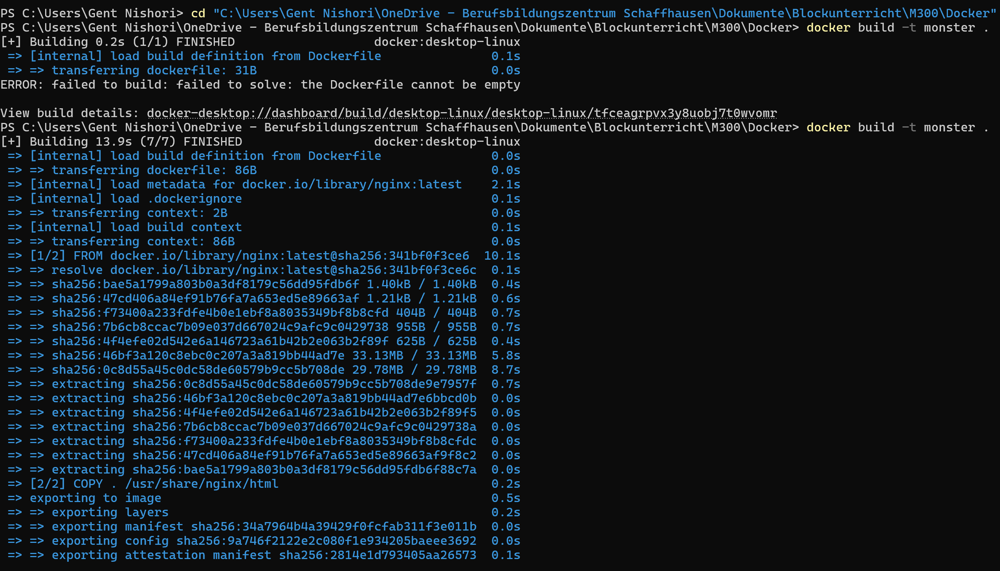

# M300-Services-NIS
Modul 300 von Gent Nishori

## Inhaltsverzeichnis
<!-- TOC -->

- [M300-Services-NIS](#m300-services-nis)
    - [Inhaltsverzeichnis](#inhaltsverzeichnis)
- [M300 – Toolumgebung einrichten](#m300--toolumgebung-einrichten)
    - [Ziel](#ziel)
    - [Verwendete Tools](#verwendete-tools)
    - [Einrichtung der Toolumgebung](#einrichtung-der-toolumgebung)
        - [Git & GitHub](#git--github)
        - [VirtualBox](#virtualbox)
        - [Vagrant](#vagrant)
        - [Probleme und Lösungen](#probleme-und-l%C3%B6sungen)
        - [Apache Webserver](#apache-webserver)
        - [Fazit](#fazit)
- [M300 – Fragen & Antworten](#m300--fragen--antworten)
    - [Cloud Computing](#cloud-computing)
        - [Was versteht man unter Cloud-Computing?](#was-versteht-man-unter-cloud-computing)
        - [Was versteht man unter Infrastructure as a Service IaaS?](#was-versteht-man-unter-infrastructure-as-a-service-iaas)
    - [Infrastructure as Code](#infrastructure-as-code)
        - [Was ist der Unterschied zur manuellen Installation einer VM?](#was-ist-der-unterschied-zur-manuellen-installation-einer-vm)
        - [Vagrant](#vagrant)
            - [Was wird mit Vagrant erzeugt?](#was-wird-mit-vagrant-erzeugt)
            - [Welche Aussagen treffen zu?](#welche-aussagen-treffen-zu)
            - [In welchen Bereich des Cloud-Computings ist Vagrant einzuordnen?](#in-welchen-bereich-des-cloud-computings-ist-vagrant-einzuordnen)
            - [Welche Alternativen zu Vagrant bestehen?](#welche-alternativen-zu-vagrant-bestehen)
            - [Wo speichert Vagrant seine Konfiguration?](#wo-speichert-vagrant-seine-konfiguration)
            - [Was bedeutet die Fehlermeldung](#was-bedeutet-die-fehlermeldung)
            - [Bei welcher LPI-Zertifizierung nützt mir das Vagrant-Wissen?](#bei-welcher-lpi-zertifizierung-n%C3%BCtzt-mir-das-vagrant-wissen)
    - [LB2 – Neue VM erstellen und Umgebung vorbereiten](#lb2--neue-vm-erstellen-und-umgebung-vorbereiten)
        - [Neue VM erstellen](#neue-vm-erstellen)
        - [Verbindung zur VM SSH](#verbindung-zur-vm-ssh)
        - [Webserver vom Host erreichbar machen Port Forwarding](#webserver-vom-host-erreichbar-machen-port-forwarding)
        - [Portweiterleitung aktivieren](#portweiterleitung-aktivieren)
        - [Zugriffstest im Browser](#zugriffstest-im-browser)
- [Fragen 25 – Sicherheit](#fragen-25--sicherheit)
    - [Firewall und Reverse Proxy](#firewall-und-reverse-proxy)
        - [Was ist der Unterschied zwischen einem Web Server und einem Reverse Proxy?](#was-ist-der-unterschied-zwischen-einem-web-server-und-einem-reverse-proxy)
        - [Was verstehen wir unter einer "White List"?](#was-verstehen-wir-unter-einer-white-list)
        - [Was wäre die Alternative zum Absichern der einzelnen Server mit einer Firewall?](#was-w%C3%A4re-die-alternative-zum-absichern-der-einzelnen-server-mit-einer-firewall)
    - [SSH](#ssh)
        - [Was ist der Unterschied zwischen der id_rsa und id_rsa.pub Datei?](#was-ist-der-unterschied-zwischen-der-id_rsa-und-id_rsapub-datei)
        - [Wo darf ein SSH Tunnel nicht angewendet werden?](#wo-darf-ein-ssh-tunnel-nicht-angewendet-werden)
        - [Für was dient die Datei authorized_keys?](#f%C3%BCr-was-dient-die-datei-authorized_keys)
        - [Für was dient die Datei known_hosts?](#f%C3%BCr-was-dient-die-datei-known_hosts)
    - [Integrationskonzept und Monitoring](#integrationskonzept-und-monitoring)
    - [Integrationskonzept](#integrationskonzept)
        - [Ziel](#ziel)
        - [Systemarchitektur](#systemarchitektur)
        - [Netzwerk-Integration](#netzwerk-integration)
        - [Firewall-Konzept](#firewall-konzept)
        - [Reverse Proxy Integration](#reverse-proxy-integration)
    - [Monitoring](#monitoring)
        - [Service-Überwachung](#service-%C3%9Cberwachung)
        - [Log-Überwachung](#log-%C3%9Cberwachung)
        - [Ressourcen-Überwachung](#ressourcen-%C3%9Cberwachung)
        - [Port-Überwachung](#port-%C3%9Cberwachung)
    - [Fazit](#fazit)
    - [Docker – Praktische Durchführung und Fehleranalyse](#docker--praktische-durchf%C3%BChrung-und-fehleranalyse)
        - [Docker Installation testen](#docker-installation-testen)
        - [Interaktiven Ubuntu-Container starten](#interaktiven-ubuntu-container-starten)
        - [Hintergrund-Container starten](#hintergrund-container-starten)
        - [Fehler: Falscher Parameter beim Build](#fehler-falscher-parameter-beim-build)
        - [Fehler: Dockerfile nicht gefunden](#fehler-dockerfile-nicht-gefunden)
        - [Fehler: Dockerfile leer](#fehler-dockerfile-leer)
    - [Webalizer Statistik](#webalizer-statistik)
        - [Docker Netzwerke anzeigen](#docker-netzwerke-anzeigen)
    - [LB3 – Hands-on Docker](#lb3--hands-on-docker)
        - [Netzwerk für LB3 erstellen](#netzwerk-f%C3%BCr-lb3-erstellen)
        - [MySQL Backend starten](#mysql-backend-starten)
        - [Ghost Frontend starten](#ghost-frontend-starten)
        - [Eigenes Docker Image erstellen Apache](#eigenes-docker-image-erstellen-apache)
        - [Problem: Container-Name bereits vergeben](#problem-container-name-bereits-vergeben)
        - [Status prüfen laufende Container](#status-pr%C3%BCfen-laufende-container)

<!-- /TOC -->

# M300 – Toolumgebung einrichten  
**Name:** Gent Nishori  
**Modul:** M300 – Infrastruktur automatisieren  
**Datum:** 09.02.2026  

---

## Ziel
Ziel dieser Arbeit ist der Aufbau einer lokalen Toolumgebung, mit der virtuelle Maschinen
automatisiert und reproduzierbar erstellt werden können.  
Dies bildet die Grundlage für *Infrastructure as Code (IaC)*.

---

## Verwendete Tools
- **Git / GitHub** – Versionsverwaltung und Ablage der Dokumentation
- **VirtualBox** – Lokaler Hypervisor für virtuelle Maschinen
- **Vagrant** – Automatisierte Erstellung und Verwaltung von VMs
- **Ubuntu 16.04 (xenial64)** – Linux Betriebssystem
- **Apache2** – Webserver
- **Visual Studio Code** – Editor für Markdown und Konfigurationsdateien

---

## Einrichtung der Toolumgebung

### Git & GitHub
Zuerst wurde ein GitHub-Repository erstellt.  
Auf dem lokalen System wurde Git installiert und mit dem eigenen GitHub-Account konfiguriert.
Die Authentifizierung erfolgt mittels SSH-Key.

---

### VirtualBox
VirtualBox wurde als Virtualisierungssoftware installiert.  
Sie dient als Provider für Vagrant.

---

### Vagrant
Für die VM wurde ein neues Verzeichnis erstellt und eine Vagrant-Umgebung initialisiert:

```bash
vagrant init ubuntu/xenial64
vagrant up
```


Anschliessend wurde per SSH eine Verbindung zur VM aufgebaut:
`vagrant ssh`


### Probleme und Lösungen
Beim ersten Start der VM trat ein Boot-Problem auf.
Nach einem Neustart der VM konnte das System korrekt gestartet werden.

Nach ein bisschen Recherche, wurde es ausgefunden das dieses Problem ist bekannt bei älteren Ubuntu-Versionen in Kombination mit aktueller
VirtualBox-Version.

### Apache Webserver
Innerhalb der VM wurde der Apache Webserver installiert:

```bash
sudo apt-get update
sudo apt-get install -y apache2
```

Der Webserver wurde erfolgreich getestet.
Webzugriff vom Host
Mittels Portweiterleitung im Vagrantfile wurde der Webserver vom Host-System erreichbar gemacht:
```ruby 
config.vm.network "forwarded_port", guest: 80, host: 8080
```
Der Zugriff erfolgte über:

http://localhost:8080
Eigene Webseite
Die Standardseite von Apache wurde angepasst.

Pfad:
/var/www/html/index.html


### Fazit
Die Toolumgebung ermöglicht es, virtuelle Maschinen schnell und reproduzierbar zu erstellen.
Durch Vagrant entfällt die manuelle Konfiguration über grafische Oberflächen.
Dies entspricht dem Prinzip von Infrastructure as Code und bildet die Basis für weitere
Automatisierungsschritte im Modul M300.


# M300 – Fragen & Antworten

## Cloud Computing

### Was versteht man unter Cloud-Computing?
Cloud Computing bezeichnet die Nutzung von IT-Ressourcen wie Programme, Speicher und Rechenleistung über ein Netzwerk (z.B. Internet), ohne dass diese lokal installiert sein müssen.

---

### Was versteht man unter Infrastructure as a Service (IaaS)?
IaaS stellt grundlegende IT-Infrastruktur wie virtuelle Maschinen, Speicher und Netzwerke zur Verfügung. Der Benutzer verwaltet Betriebssystem und Software selbst.

---

## Infrastructure as Code

### Was ist der Unterschied zur manuellen Installation einer VM?
Infrastructure as Code ermöglicht eine automatisierte, reproduzierbare und dokumentierte Erstellung von virtuellen Maschinen, im Gegensatz zur manuellen Installation über eine grafische Oberfläche.

---

### Vagrant

#### Was wird mit Vagrant erzeugt?
Mit Vagrant werden virtuelle Maschinen erstellt und verwaltet.

---

#### Welche Aussagen treffen zu?
Richtig ist:  
**b** Vagrant erzeugt virtuelle Maschinen und unterstützt verschiedene Hypervisoren und Cloud-Umgebungen.

---

#### In welchen Bereich des Cloud-Computings ist Vagrant einzuordnen?
Vagrant ist dem Bereich **Infrastructure as a Service (IaaS)** zuzuordnen.

---

#### Welche Alternativen zu Vagrant bestehen?
Mögliche Alternativen sind z.B. Terraform, Docker, Packer oder direkte VirtualBox-Konfigurationen.

---

#### Wo speichert Vagrant seine Konfiguration?
Die Konfiguration wird im **Vagrantfile** gespeichert.

---

#### Was bedeutet die Fehlermeldung  
„A Vagrant environment or target machine is required to run this command.“?
Der Befehl wurde in einem Verzeichnis ausgeführt, in dem keine `Vagrantfile` vorhanden ist.

---

#### Bei welcher LPI-Zertifizierung nützt mir das Vagrant-Wissen?
Das Wissen ist hilfreich für die **LPI DevOps Tools Engineer** Zertifizierung.

---


## LB2 – Neue VM erstellen und Umgebung vorbereiten 

**Ziel:**  
Eine neue Test-VM mit Vagrant erstellen, um Serverdienste (Apache + Webalizer) zuerst manuell zu testen und danach zu automatisieren.

---

### 1) Neue VM erstellen
Im Arbeitsverzeichnis wurde ein neues VM-Verzeichnis erstellt und eine Vagrant-Umgebung initialisiert:

```bash
cd myM300/
mkdir myVM
cd myVM
vagrant init ubuntu/xenial64
vagrant up --provider virtualbox
```
### Verbindung zur VM (SSH)
Nach dem Start wurde die VM via SSH betreten:

`vagrant ssh`


### Webserver vom Host erreichbar machen (Port Forwarding)
Damit der Apache-Webserver aus der VM im Browser auf dem Host erreichbar ist, wurde im Vagrantfile eine Portweiterleitung eingerichtet:
``` ruby
config.vm.network "forwarded_port", guest: 80, host: 8081, auto_correct: true
```
Hinweis:
Standardmässig wird oft host: 8080 verwendet. Bei mir war der Port 8080 bereits belegt, deshalb wurde 8081 gewählt.

### Portweiterleitung aktivieren
Nach der Änderung am Vagrantfile wurde die VM neu geladen, damit die Portweiterleitung übernommen wird:

`vagrant reload`
Anschliessend wurden die weitergeleiteten Ports geprüft:

`vagrant port`
Erwartetes Resultat (Beispiel):

80 (guest) => 8081 (host)

### Zugriffstest im Browser
Der Webserver kann nun über den Host-Browser getestet werden:

Apache:
http://localhost:8081

Webalizer (später nach Installation):
http://localhost:8081/webalizer/

Problem / Lösung
Problem: Port 8080 war auf dem Host bereits besetzt → Webseite nicht erreichbar.
Lösung: Port im Vagrantfile auf 8081 geändert und VM mit vagrant reload neu geladen.




# Fragen 25 – Sicherheit

## Firewall und Reverse Proxy

### Was ist der Unterschied zwischen einem Web Server und einem Reverse Proxy?

Ein **Web Server** liefert direkt Inhalte wie HTML-Seiten, Bilder oder APIs an den Client aus.  

Ein **Reverse Proxy** fungiert als Vermittler zwischen Client und Backend-Server.  
Er nimmt Anfragen entgegen und leitet sie an interne Server weiter. Dadurch werden Sicherheit, Lastverteilung und zentrale Steuerung ermöglicht.

---

### Was verstehen wir unter einer "White List"?

Eine **White List** ist eine Liste mit vertrauenswürdigen Elementen (z.B. IP-Adressen oder Servern), denen der Zugriff ausdrücklich erlaubt wird.  

Im Gegensatz dazu blockiert eine **Black List** nur bekannte unerwünschte Elemente.

---

### Was wäre die Alternative zum Absichern der einzelnen Server mit einer Firewall?

Anstelle jeder einzelnen Server-Firewall kann eine **zentrale Firewall** eingesetzt werden.  
Diese kontrolliert den gesamten Netzwerkverkehr an einem zentralen Punkt.

---

## SSH

### Was ist der Unterschied zwischen der id_rsa und id_rsa.pub Datei?

- **id_rsa** → Privater Schlüssel (geheim, darf niemals weitergegeben werden)  
- **id_rsa.pub** → Öffentlicher Schlüssel (darf auf Servern hinterlegt werden)

---

### Wo darf ein SSH Tunnel nicht angewendet werden?

Ein SSH-Tunnel darf nicht ohne Genehmigung in einer Firmenumgebung verwendet werden, da er Sicherheitsrichtlinien und Firewalls umgehen kann.

---

### Für was dient die Datei authorized_keys?

Die Datei `authorized_keys` enthält die öffentlichen Schlüssel von Benutzern, die sich ohne Passwort per SSH auf dem System anmelden dürfen.

---

### Für was dient die Datei known_hosts?

Die Datei `known_hosts` speichert die öffentlichen Host-Schlüssel der Server, mit denen bereits eine SSH-Verbindung aufgebaut wurde.  
Sie dient zur Verifikation der Server-Identität und schützt vor Man-in-the-Middle-Angriffen.


## Integrationskonzept und Monitoring

## Integrationskonzept

### Ziel

Ziel dieses Abschnitts ist es, den Apache-Webserver sicher in die bestehende Vagrant-Umgebung zu integrieren und den Betrieb nachvollziehbar zu dokumentieren.

---

### Systemarchitektur

Die Integration erfolgt nach folgendem Prinzip:

Client (Browser)  
→ Host-System (Port Forwarding)  
→ Vagrant VM  
→ Apache Webserver  
→ optional Backend-Service  

Der Zugriff vom Host erfolgt über einen weitergeleiteten Port (z.B. 8081), welcher intern auf Port 80 der VM verweist.

---

### Netzwerk-Integration

Portweiterleitung im `Vagrantfile`:

```ruby
config.vm.network "forwarded_port", guest: 80, host: 8081, auto_correct: true
```

Dadurch wird:

- Host Port 8081
- auf VM Port 80
- weitergeleitet

Zugriff erfolgt über:

```
http://localhost:8081
```

---

### Firewall-Konzept

Zur Absicherung der VM wurde UFW (Uncomplicated Firewall) eingesetzt.

Standard-Regeln:

```bash
sudo ufw default deny incoming
sudo ufw default allow outgoing
```
Firewall:



Bedeutung:

- Eingehende Verbindungen werden blockiert
- Ausgehende Verbindungen sind erlaubt

Freigegebene Ports:

```bash
sudo ufw allow 22/tcp
sudo ufw allow 80/tcp
```

| Port | Zweck |
|------|--------|
| 22   | SSH Administration |
| 80   | Webserver (Apache) |

Alle anderen Ports bleiben geschlossen.

---

### Reverse Proxy Integration

Apache kann als Reverse Proxy eingesetzt werden, um interne Dienste zu schützen.

Aktivierte Module:

```bash
sudo a2enmod proxy
sudo a2enmod proxy_http
sudo a2enmod proxy_html
```

Beispiel-Konfiguration:

```apache
<VirtualHost *:80>
    ServerName localhost

    ProxyPreserveHost On
    ProxyPass / http://127.0.0.1:8080/
    ProxyPassReverse / http://127.0.0.1:8080/

    ErrorLog ${APACHE_LOG_DIR}/reverseproxy_error.log
    CustomLog ${APACHE_LOG_DIR}/reverseproxy_access.log combined
</VirtualHost>
```

Der Backend-Service ist dadurch nicht direkt erreichbar, sondern nur über den Reverse Proxy.

---

## Monitoring

Ziel des Monitorings ist es, die Verfügbarkeit und Stabilität des Webservers im Betrieb sicherzustellen.

---

### Service-Überwachung

Status prüfen:

```bash
sudo systemctl status apache2
```

Erwartetes Resultat:

```
active (running)
```

---

### Log-Überwachung

Error-Log prüfen:

```bash
sudo tail -f /var/log/apache2/error.log
```

Access-Log prüfen:

```bash
sudo tail -f /var/log/apache2/access.log
```

Damit können Fehler und Zugriffe nachvollzogen werden.

---

### Ressourcen-Überwachung

CPU / RAM prüfen:

```bash
top
```

Speicherplatz prüfen:

```bash
df -h
```

Arbeitsspeicher prüfen:

```bash
free -m
```

---

### Port-Überwachung

Offene Ports anzeigen:

```bash
sudo ss -tulpn
```

Kontrolle:

- Läuft Apache auf Port 80?
- Sind nur erwartete Dienste aktiv?

---

## Fazit

Durch das Integrationskonzept wird sichergestellt, dass der Webserver strukturiert und sicher in die Umgebung eingebunden ist.

Das Monitoring gewährleistet einen stabilen und kontrollierten Betrieb im laufenden System.


## Docker – Praktische Durchführung und Fehleranalyse

### Docker Installation testen

Mit folgendem Befehl wurde geprüft, ob Docker korrekt funktioniert:

```bash
docker run hello-world
```

Docker hat das Image automatisch heruntergeladen und einen Test-Container gestartet.  
Die erfolgreiche Ausgabe bestätigt, dass Docker korrekt installiert ist.

---

### Interaktiven Ubuntu-Container starten

```bash
docker run -it ubuntu /bin/bash
```

- `-i` → interaktiver Modus  
- `-t` → Terminal  
- `/bin/bash` → Bash-Shell im Container  

Der Container wurde anschliessend mit `exit` beendet.

---

### Hintergrund-Container starten

```bash
docker run -d ubuntu sleep 20
```

Der Container führte den Befehl `sleep 20` aus und beendete sich nach 20 Sekunden automatisch.

Ein Docker-Container läuft nur, solange sein Hauptprozess aktiv ist.

---

### Fehler: Falscher Parameter beim Build

Folgender Befehl wurde falsch verwendet:

```bash
docker build -p 8080:3000 -t monster .
```

Fehlermeldung:

```
unknown shorthand flag: 'p' in -p
```

Der Parameter `-p` gehört zu `docker run` und nicht zu `docker build`.

Korrekt:

```bash
docker build -t monster .
docker run -p 8080:80 monster
```

---

### Fehler: Dockerfile nicht gefunden

```bash
docker build -t monster .
```

Fehlermeldung:

```
failed to read dockerfile: open Dockerfile: no such file or directory
```

Docker sucht im aktuellen Verzeichnis (`.`) nach einer Datei mit dem Namen `Dockerfile`.

Lösung:
- In das richtige Verzeichnis wechseln
- Sicherstellen, dass die Datei `Dockerfile` existiert

---

### Fehler: Dockerfile leer

Fehlermeldung:

```
the Dockerfile cannot be empty
```

Die Datei `Dockerfile` existierte, war jedoch leer.

Beispiel einer funktionierenden Dockerfile:

```dockerfile
FROM nginx:latest
COPY . /usr/share/nginx/html
```

Danach konnte das Image erfolgreich gebaut werden:

```bash
docker build -t monster .
```

---

### Docker Netzwerke anzeigen

```bash
docker network ls
```

Standardmässig existieren:

- bridge  
- host  
- none  

Docker verwendet standardmässig das `bridge` Netzwerk.

---

## LB3 – Hands-on (Docker)

### Netzwerk für LB3 erstellen

Zuerst wurde ein eigenes Docker-Netzwerk erstellt, damit sich die Container untereinander finden können:

```bash
docker network create lb3-net
```

---

### MySQL (Backend) starten

Der Datenbank-Container wurde gestartet und die notwendigen Umgebungsvariablen gesetzt:

```bash
docker run -d --name ghost_mysql --network lb3-net `
  -e MYSQL_ROOT_PASSWORD=admin `
  -e MYSQL_USER=ghost `
  -e MYSQL_PASSWORD=secret `
  -e MYSQL_DATABASE=ghost `
  --restart=always `
  mysql:5.7
```

Prüfen ob der Container läuft:

```bash
docker ps
```

Logs kontrollieren:

```bash
docker logs ghost_mysql
```

Ergebnis: MySQL ist bereit („ready for connections“).

---

### Ghost (Frontend) starten

Ghost wurde im gleichen Netzwerk gestartet und mit der MySQL-Datenbank verbunden:

```bash
docker run -d --name ghost --network lb3-net `
  -e database__client=mysql `
  -e database__connection__host=ghost_mysql `
  -e database__connection__user=ghost `
  -e database__connection__password=secret `
  -e database__connection__database=ghost `
  -p 2368:2368 `
  --restart=always `
  ghost:1-alpine
```

Zugriff im Browser:

- `http://localhost:2368`

Screenshot:


---

### Eigenes Docker Image erstellen (Apache)

Für den eigenen Container wurde ein Ordner erstellt und darin das Image gebaut:

```bash
mkdir lb3-apache
cd lb3-apache
docker build -t lb3-apache .
```

Container starten und Port freigeben:

```bash
docker run -d --name myapache -p 8080:80 lb3-apache
```

Zugriff im Browser:

- `http://localhost:8080`

---

### Problem: Container-Name bereits vergeben

Beim erneuten Starten trat ein Konflikt auf, da der Containername bereits existierte:

Fehlermeldung (Beispiel):

```
Conflict. The container name "/myapache" is already in use ...
```

Lösung: Container stoppen und entfernen, danach erneut starten:

```bash
docker stop myapache
docker rm myapache
docker run -d --name myapache -p 8080:80 lb3-apache
```

---

### Status prüfen (laufende Container)

```bash
docker ps
```

Ergebnis:
- `ghost_mysql` läuft (Backend)
- `ghost` läuft (Frontend)
- `myapache` läuft (eigener Container)

Beim Apache-Container war Healthcheck aktiv (Status z.B. `health: starting`).

---


