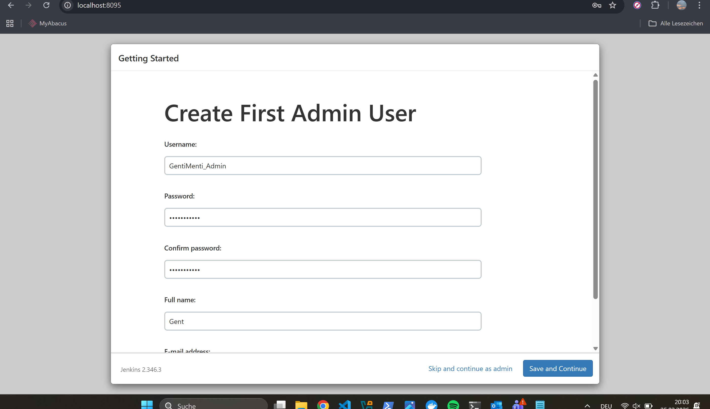

# M300-Services-NIS
Modul 300 von Gent Nishori

## Inhaltsverzeichnis
<!-- TOC -->

- [M300-Services-NIS](#m300-services-nis)
  - [Inhaltsverzeichnis](#inhaltsverzeichnis)
- [M300 – Toolumgebung einrichten](#m300--toolumgebung-einrichten)
  - [Ziel](#ziel)
  - [Verwendete Tools](#verwendete-tools)
  - [Einrichtung der Toolumgebung](#einrichtung-der-toolumgebung)
- [M300 – Fragen \& Antworten](#m300--fragen--antworten)
  - [Cloud Computing](#cloud-computing)
  - [Infrastructure as Code](#infrastructure-as-code)
  - [LB2 – Neue VM erstellen und Umgebung vorbereiten](#lb2--neue-vm-erstellen-und-umgebung-vorbereiten)
- [Fragen 25 – Sicherheit](#fragen-25--sicherheit)
  - [Firewall und Reverse Proxy](#firewall-und-reverse-proxy)
  - [SSH](#ssh)
  - [Integrationskonzept und Monitoring](#integrationskonzept-und-monitoring)
  - [Integrationskonzept](#integrationskonzept)
  - [Monitoring](#monitoring)
  - [Fazit](#fazit-1)
  - [Docker – Praktische Durchführung und Fehleranalyse](#docker--praktische-durchführung-und-fehleranalyse)
  - [](#)
  - [LB3 – Hands-on (Docker)](#lb3--hands-on-docker)
- [35 – Sicherheit](#35--sicherheit)
  - [Fragen \& Antworten](#fragen--antworten)
  - [Protokollieren \& Überwachen](#protokollieren--überwachen)
  - [Container sichern \& beschränken](#container-sichern--beschränken)
  - [Kontinuierliche Integration (CI)](#kontinuierliche-integration-ci)
- [Secure Docker Container – Fehleranalyse \& Härtung](#secure-docker-container--fehleranalyse--härtung)
  - [1. Image Build](#1-image-build)
  - [2. Fehler 1 – Falscher Image-Name](#2-fehler-1--falscher-image-name)
  - [3. Fehler 2 – Port bereits blockiert](#3-fehler-2--port-bereits-blockiert)
  - [4. Fehler 3 – Container Name bereits vergeben](#4-fehler-3--container-name-bereits-vergeben)
  - [5. Sicherheits-Härtung mit docker run](#5-sicherheits-härtung-mit-docker-run)
  - [6. Fehler 4 – Read-only Filesystem](#6-fehler-4--read-only-filesystem)
  - [7. Fehler 5 – Permission denied](#7-fehler-5--permission-denied)
  - [8. Fehler 6 – chown Operation not permitted](#8-fehler-6--chown-operation-not-permitted)
  - [9. Analyse](#9-analyse)
  - [10. Fazit (Container Security Learning)](#10-fazit-container-security-learning)
  - [11. Erkenntnisse für LB 3 / 35-Sicherheit](#11-erkenntnisse-für-lb-3--35-sicherheit)
  - [12. Test-Kommandos](#12-test-kommandos)
- [Endergebnis](#endergebnis)
- [40 – Jenkins Blue Ocean Dokumentation](#40--jenkins-blue-ocean-dokumentation)
  - [1. Blue Ocean Container starten](#1-blue-ocean-container-starten)
  - [2. Port-Problem](#2-port-problem)
  - [3. Initial Setup](#3-initial-setup)
  - [4. Admin User erstellen](#4-admin-user-erstellen)
  - [5. Plugin-Installationsproblem](#5-plugin-installationsproblem)
  - [6. Safe Restart](#6-safe-restart)
  - [7. Ergebnis](#7-ergebnis)
  - [8. Fazit](#8-fazit)
- [40 – Kubernetes (K8s) Dokumentation](#40--kubernetes-k8s-dokumentation)
  - [Lernziel](#lernziel)
- [01 – Grundbegriffe](#01--grundbegriffe)
  - [Service Discovery](#service-discovery)
  - [Load Balancing](#load-balancing)
  - [Cluster](#cluster)
- [02 – Kubernetes](#02--kubernetes)
  - [Wichtige Objekte](#wichtige-objekte)
- [03 – Beispiel: Eigene Installation \& Aufsetzung](#03--beispiel-eigene-installation--aufsetzung)
  - [Variante: Kubernetes mit Vagrant (Projekt lernkube)](#variante-kubernetes-mit-vagrant-projekt-lernkube)
  - [Schritt 1 – Repository klonen](#schritt-1--repository-klonen)
  - [Schritt 2 – Cluster starten](#schritt-2--cluster-starten)
  - [Schritt 3 – Zugriff auf kubectl aktivieren (Windows)](#schritt-3--zugriff-auf-kubectl-aktivieren-windows)
- [04 – Hands-On: Apache Webserver Deployment](#04--hands-on-apache-webserver-deployment)
  - [Namespace erstellen](#namespace-erstellen)
  - [Pod erstellen](#pod-erstellen)
  - [YAML anzeigen](#yaml-anzeigen)
  - [Service erstellen](#service-erstellen)
  - [Zugriff auf den Webserver](#zugriff-auf-den-webserver)
- [05 – Deployment via YAML](#05--deployment-via-yaml)
  - [apache-pod.yaml](#apache-podyaml)
  - [apache-service.yaml](#apache-serviceyaml)
  - [Namespace für YAML Variante](#namespace-für-yaml-variante)
- [06 – Wichtige Erkenntnisse](#06--wichtige-erkenntnisse)
- [07 – Reflexion](#07--reflexion)

<!-- /TOC -->

# M300 – Toolumgebung einrichten  
**Name:** Gent Nishori  
**Modul:** M300 – Infrastruktur automatisieren  
**Datum:** 09.02.2026  

---

## Ziel
Ziel dieser Arbeit ist der Aufbau einer lokalen Toolumgebung, mit der virtuelle Maschinen
automatisiert und reproduzierbar erstellt werden können.  
Dies bildet die Grundlage für *Infrastructure as Code (IaC)*.

---

## Verwendete Tools
- **Git / GitHub** – Versionsverwaltung und Ablage der Dokumentation
- **VirtualBox** – Lokaler Hypervisor für virtuelle Maschinen
- **Vagrant** – Automatisierte Erstellung und Verwaltung von VMs
- **Ubuntu 16.04 (xenial64)** – Linux Betriebssystem
- **Apache2** – Webserver
- **Visual Studio Code** – Editor für Markdown und Konfigurationsdateien

---

## Einrichtung der Toolumgebung

### Git & GitHub
Zuerst wurde ein GitHub-Repository erstellt.  
Auf dem lokalen System wurde Git installiert und mit dem eigenen GitHub-Account konfiguriert.
Die Authentifizierung erfolgt mittels SSH-Key.

---

### VirtualBox
VirtualBox wurde als Virtualisierungssoftware installiert.  
Sie dient als Provider für Vagrant.

---

### Vagrant
Für die VM wurde ein neues Verzeichnis erstellt und eine Vagrant-Umgebung initialisiert:

```bash
vagrant init ubuntu/xenial64
vagrant up
```


Anschliessend wurde per SSH eine Verbindung zur VM aufgebaut:
`vagrant ssh`


### Probleme und Lösungen
Beim ersten Start der VM trat ein Boot-Problem auf.
Nach einem Neustart der VM konnte das System korrekt gestartet werden.

Nach ein bisschen Recherche, wurde es ausgefunden das dieses Problem ist bekannt bei älteren Ubuntu-Versionen in Kombination mit aktueller
VirtualBox-Version.

### Apache Webserver
Innerhalb der VM wurde der Apache Webserver installiert:

```bash
sudo apt-get update
sudo apt-get install -y apache2
```

Der Webserver wurde erfolgreich getestet.
Webzugriff vom Host
Mittels Portweiterleitung im Vagrantfile wurde der Webserver vom Host-System erreichbar gemacht:
```ruby 
config.vm.network "forwarded_port", guest: 80, host: 8080
```
Der Zugriff erfolgte über:

http://localhost:8080
Eigene Webseite
Die Standardseite von Apache wurde angepasst.

Pfad:
/var/www/html/index.html


### Fazit
Die Toolumgebung ermöglicht es, virtuelle Maschinen schnell und reproduzierbar zu erstellen.
Durch Vagrant entfällt die manuelle Konfiguration über grafische Oberflächen.
Dies entspricht dem Prinzip von Infrastructure as Code und bildet die Basis für weitere
Automatisierungsschritte im Modul M300.


# M300 – Fragen & Antworten

## Cloud Computing

### Was versteht man unter Cloud-Computing?
Cloud Computing bezeichnet die Nutzung von IT-Ressourcen wie Programme, Speicher und Rechenleistung über ein Netzwerk (z.B. Internet), ohne dass diese lokal installiert sein müssen.

---

### Was versteht man unter Infrastructure as a Service (IaaS)?
IaaS stellt grundlegende IT-Infrastruktur wie virtuelle Maschinen, Speicher und Netzwerke zur Verfügung. Der Benutzer verwaltet Betriebssystem und Software selbst.

---

## Infrastructure as Code

### Was ist der Unterschied zur manuellen Installation einer VM?
Infrastructure as Code ermöglicht eine automatisierte, reproduzierbare und dokumentierte Erstellung von virtuellen Maschinen, im Gegensatz zur manuellen Installation über eine grafische Oberfläche.

---

### Vagrant

#### Was wird mit Vagrant erzeugt?
Mit Vagrant werden virtuelle Maschinen erstellt und verwaltet.

---

#### Welche Aussagen treffen zu?
Richtig ist:  
**b** Vagrant erzeugt virtuelle Maschinen und unterstützt verschiedene Hypervisoren und Cloud-Umgebungen.

---

#### In welchen Bereich des Cloud-Computings ist Vagrant einzuordnen?
Vagrant ist dem Bereich **Infrastructure as a Service (IaaS)** zuzuordnen.

---

#### Welche Alternativen zu Vagrant bestehen?
Mögliche Alternativen sind z.B. Terraform, Docker, Packer oder direkte VirtualBox-Konfigurationen.

---

#### Wo speichert Vagrant seine Konfiguration?
Die Konfiguration wird im **Vagrantfile** gespeichert.

---

#### Was bedeutet die Fehlermeldung  
„A Vagrant environment or target machine is required to run this command.“?
Der Befehl wurde in einem Verzeichnis ausgeführt, in dem keine `Vagrantfile` vorhanden ist.

---

#### Bei welcher LPI-Zertifizierung nützt mir das Vagrant-Wissen?
Das Wissen ist hilfreich für die **LPI DevOps Tools Engineer** Zertifizierung.

---


## LB2 – Neue VM erstellen und Umgebung vorbereiten 

**Ziel:**  
Eine neue Test-VM mit Vagrant erstellen, um Serverdienste (Apache + Webalizer) zuerst manuell zu testen und danach zu automatisieren.

---

### 1) Neue VM erstellen
Im Arbeitsverzeichnis wurde ein neues VM-Verzeichnis erstellt und eine Vagrant-Umgebung initialisiert:

```bash
cd myM300/
mkdir myVM
cd myVM
vagrant init ubuntu/xenial64
vagrant up --provider virtualbox
```
### Verbindung zur VM (SSH)
Nach dem Start wurde die VM via SSH betreten:

`vagrant ssh`


### Webserver vom Host erreichbar machen (Port Forwarding)
Damit der Apache-Webserver aus der VM im Browser auf dem Host erreichbar ist, wurde im Vagrantfile eine Portweiterleitung eingerichtet:
``` ruby
config.vm.network "forwarded_port", guest: 80, host: 8081, auto_correct: true
```
Hinweis:
Standardmässig wird oft host: 8080 verwendet. Bei mir war der Port 8080 bereits belegt, deshalb wurde 8081 gewählt.

### Portweiterleitung aktivieren
Nach der Änderung am Vagrantfile wurde die VM neu geladen, damit die Portweiterleitung übernommen wird:

`vagrant reload`
Anschliessend wurden die weitergeleiteten Ports geprüft:

`vagrant port`
Erwartetes Resultat (Beispiel):

80 (guest) => 8081 (host)

### Zugriffstest im Browser
Der Webserver kann nun über den Host-Browser getestet werden:

Apache:
http://localhost:8081

Webalizer (später nach Installation):
http://localhost:8081/webalizer/

Problem / Lösung
Problem: Port 8080 war auf dem Host bereits besetzt → Webseite nicht erreichbar.
Lösung: Port im Vagrantfile auf 8081 geändert und VM mit vagrant reload neu geladen.


# Fragen 25 – Sicherheit

## Firewall und Reverse Proxy

### Was ist der Unterschied zwischen einem Web Server und einem Reverse Proxy?

Ein **Web Server** liefert direkt Inhalte wie HTML-Seiten, Bilder oder APIs an den Client aus.  

Ein **Reverse Proxy** fungiert als Vermittler zwischen Client und Backend-Server.  
Er nimmt Anfragen entgegen und leitet sie an interne Server weiter. Dadurch werden Sicherheit, Lastverteilung und zentrale Steuerung ermöglicht.

---

### Was verstehen wir unter einer "White List"?

Eine **White List** ist eine Liste mit vertrauenswürdigen Elementen (z.B. IP-Adressen oder Servern), denen der Zugriff ausdrücklich erlaubt wird.  

Im Gegensatz dazu blockiert eine **Black List** nur bekannte unerwünschte Elemente.

---

### Was wäre die Alternative zum Absichern der einzelnen Server mit einer Firewall?

Anstelle jeder einzelnen Server-Firewall kann eine **zentrale Firewall** eingesetzt werden.  
Diese kontrolliert den gesamten Netzwerkverkehr an einem zentralen Punkt.

---

## SSH

### Was ist der Unterschied zwischen der id_rsa und id_rsa.pub Datei?

- **id_rsa** → Privater Schlüssel (geheim, darf niemals weitergegeben werden)  
- **id_rsa.pub** → Öffentlicher Schlüssel (darf auf Servern hinterlegt werden)

---

### Wo darf ein SSH Tunnel nicht angewendet werden?

Ein SSH-Tunnel darf nicht ohne Genehmigung in einer Firmenumgebung verwendet werden, da er Sicherheitsrichtlinien und Firewalls umgehen kann.

---

### Für was dient die Datei authorized_keys?

Die Datei `authorized_keys` enthält die öffentlichen Schlüssel von Benutzern, die sich ohne Passwort per SSH auf dem System anmelden dürfen.

---

### Für was dient die Datei known_hosts?

Die Datei `known_hosts` speichert die öffentlichen Host-Schlüssel der Server, mit denen bereits eine SSH-Verbindung aufgebaut wurde.  
Sie dient zur Verifikation der Server-Identität und schützt vor Man-in-the-Middle-Angriffen.


## Integrationskonzept und Monitoring

## Integrationskonzept

### Ziel

Ziel dieses Abschnitts ist es, den Apache-Webserver sicher in die bestehende Vagrant-Umgebung zu integrieren und den Betrieb nachvollziehbar zu dokumentieren.

---

### Systemarchitektur

Die Integration erfolgt nach folgendem Prinzip:

Client (Browser)  
→ Host-System (Port Forwarding)  
→ Vagrant VM  
→ Apache Webserver  
→ optional Backend-Service  

Der Zugriff vom Host erfolgt über einen weitergeleiteten Port (z.B. 8081), welcher intern auf Port 80 der VM verweist.

---

### Netzwerk-Integration

Portweiterleitung im `Vagrantfile`:

```ruby
config.vm.network "forwarded_port", guest: 80, host: 8081, auto_correct: true
```

Dadurch wird:

- Host Port 8081
- auf VM Port 80
- weitergeleitet

Zugriff erfolgt über:

```
http://localhost:8081
```

---

### Firewall-Konzept

Zur Absicherung der VM wurde UFW (Uncomplicated Firewall) eingesetzt.

Standard-Regeln:

```bash
sudo ufw default deny incoming
sudo ufw default allow outgoing
```
Firewall:


Bedeutung:

- Eingehende Verbindungen werden blockiert
- Ausgehende Verbindungen sind erlaubt

Freigegebene Ports:

```bash
sudo ufw allow 22/tcp
sudo ufw allow 80/tcp
```

| Port | Zweck |
|------|--------|
| 22   | SSH Administration |
| 80   | Webserver (Apache) |

Alle anderen Ports bleiben geschlossen.

---

### Reverse Proxy Integration

Apache kann als Reverse Proxy eingesetzt werden, um interne Dienste zu schützen.

Aktivierte Module:

```bash
sudo a2enmod proxy
sudo a2enmod proxy_http
sudo a2enmod proxy_html
```

Beispiel-Konfiguration:

```apache
<VirtualHost *:80>
    ServerName localhost

    ProxyPreserveHost On
    ProxyPass / http://127.0.0.1:8080/
    ProxyPassReverse / http://127.0.0.1:8080/

    ErrorLog ${APACHE_LOG_DIR}/reverseproxy_error.log
    CustomLog ${APACHE_LOG_DIR}/reverseproxy_access.log combined
</VirtualHost>
```

Der Backend-Service ist dadurch nicht direkt erreichbar, sondern nur über den Reverse Proxy.

---

## Monitoring

Ziel des Monitorings ist es, die Verfügbarkeit und Stabilität des Webservers im Betrieb sicherzustellen.

---

### Service-Überwachung

Status prüfen:

```bash
sudo systemctl status apache2
```

Erwartetes Resultat:

```
active (running)
```

---

### Log-Überwachung

Error-Log prüfen:

```bash
sudo tail -f /var/log/apache2/error.log
```

Access-Log prüfen:

```bash
sudo tail -f /var/log/apache2/access.log
```

Damit können Fehler und Zugriffe nachvollzogen werden.

---

### Ressourcen-Überwachung

CPU / RAM prüfen:

```bash
top
```

Speicherplatz prüfen:

```bash
df -h
```

Arbeitsspeicher prüfen:

```bash
free -m
```

---

### Port-Überwachung

Offene Ports anzeigen:

```bash
sudo ss -tulpn
```

Kontrolle:

- Läuft Apache auf Port 80?
- Sind nur erwartete Dienste aktiv?

---

## Fazit

Durch das Integrationskonzept wird sichergestellt, dass der Webserver strukturiert und sicher in die Umgebung eingebunden ist.

Das Monitoring gewährleistet einen stabilen und kontrollierten Betrieb im laufenden System.


## Docker – Praktische Durchführung und Fehleranalyse

### Docker Installation testen

Mit folgendem Befehl wurde geprüft, ob Docker korrekt funktioniert:

```bash
docker run hello-world
```

Docker hat das Image automatisch heruntergeladen und einen Test-Container gestartet.  
Die erfolgreiche Ausgabe bestätigt, dass Docker korrekt installiert ist.

---

### Interaktiven Ubuntu-Container starten

```bash
docker run -it ubuntu /bin/bash
```

- `-i` → interaktiver Modus  
- `-t` → Terminal  
- `/bin/bash` → Bash-Shell im Container  

Der Container wurde anschliessend mit `exit` beendet.

---

### Hintergrund-Container starten

```bash
docker run -d ubuntu sleep 20
```

Der Container führte den Befehl `sleep 20` aus und beendete sich nach 20 Sekunden automatisch.

Ein Docker-Container läuft nur, solange sein Hauptprozess aktiv ist.

---

### Fehler: Falscher Parameter beim Build

Folgender Befehl wurde falsch verwendet:

```bash
docker build -p 8080:3000 -t monster .
```

Fehlermeldung:

```
unknown shorthand flag: 'p' in -p
```

Der Parameter `-p` gehört zu `docker run` und nicht zu `docker build`.

Korrekt:

```bash
docker build -t monster .
docker run -p 8080:80 monster
```

---

### Fehler: Dockerfile nicht gefunden

```bash
docker build -t monster .
```

Fehlermeldung:

```
failed to read dockerfile: open Dockerfile: no such file or directory
```

Docker sucht im aktuellen Verzeichnis (`.`) nach einer Datei mit dem Namen `Dockerfile`.

Lösung:
- In das richtige Verzeichnis wechseln
- Sicherstellen, dass die Datei `Dockerfile` existiert

---

### Fehler: Dockerfile leer

Fehlermeldung:

```
the Dockerfile cannot be empty
```

Die Datei `Dockerfile` existierte, war jedoch leer.

Beispiel einer funktionierenden Dockerfile:

```dockerfile
FROM nginx:latest
COPY . /usr/share/nginx/html
```

Danach konnte das Image erfolgreich gebaut werden:

```bash
docker build -t monster .
```

---

### Docker Netzwerke anzeigen

```bash
docker network ls
```

Standardmässig existieren:

- bridge  
- host  
- none  

Docker verwendet standardmässig das `bridge` Netzwerk.

---

## LB3 – Hands-on (Docker)

### Netzwerk für LB3 erstellen

Zuerst wurde ein eigenes Docker-Netzwerk erstellt, damit sich die Container untereinander finden können:

```bash
docker network create lb3-net
```

---

### MySQL (Backend) starten

Der Datenbank-Container wurde gestartet und die notwendigen Umgebungsvariablen gesetzt:

```bash
docker run -d --name ghost_mysql --network lb3-net `
  -e MYSQL_ROOT_PASSWORD=admin `
  -e MYSQL_USER=ghost `
  -e MYSQL_PASSWORD=secret `
  -e MYSQL_DATABASE=ghost `
  --restart=always `
  mysql:5.7
```

Prüfen ob der Container läuft:

```bash
docker ps
```

Logs kontrollieren:

```bash
docker logs ghost_mysql
```

Ergebnis: MySQL ist bereit („ready for connections“).

---

### Ghost (Frontend) starten

Ghost wurde im gleichen Netzwerk gestartet und mit der MySQL-Datenbank verbunden:

```bash
docker run -d --name ghost --network lb3-net `
  -e database__client=mysql `
  -e database__connection__host=ghost_mysql `
  -e database__connection__user=ghost `
  -e database__connection__password=secret `
  -e database__connection__database=ghost `
  -p 2368:2368 `
  --restart=always `
  ghost:1-alpine
```

Zugriff im Browser:

- `http://localhost:2368`

Screenshot:


---

### Eigenes Docker Image erstellen (Apache)

Für den eigenen Container wurde ein Ordner erstellt und darin das Image gebaut:

```bash
mkdir lb3-apache
cd lb3-apache
docker build -t lb3-apache .
```

Container starten und Port freigeben:

```bash
docker run -d --name myapache -p 8080:80 lb3-apache
```

Zugriff im Browser:

- `http://localhost:8080`

---

### Problem: Container-Name bereits vergeben

Beim erneuten Starten trat ein Konflikt auf, da der Containername bereits existierte:

Fehlermeldung (Beispiel):

```
Conflict. The container name "/myapache" is already in use ...
```

Lösung: Container stoppen und entfernen, danach erneut starten:

```bash
docker stop myapache
docker rm myapache
docker run -d --name myapache -p 8080:80 lb3-apache
```

---

### Status prüfen (laufende Container)

```bash
docker ps
```

Ergebnis:
- `ghost_mysql` läuft (Backend)
- `ghost` läuft (Frontend)
- `myapache` läuft (eigener Container)

Beim Apache-Container war Healthcheck aktiv (Status z.B. `health: starting`).

---

# 35 – Sicherheit  
## Fragen & Antworten

---

## Protokollieren & Überwachen

### Warum sollten Container überwacht werden?

Container sollten überwacht werden, um Fehler, Abstürze oder ungewöhnlich hohe Ressourcenbelastungen (CPU, RAM, Storage) frühzeitig zu erkennen und rechtzeitig eingreifen zu können.

---

### Was ist das syslog und wo ist es zu finden?

**Syslog** ist das zentrale Log-System eines Linux-Hosts.  
Es sammelt System- und Dienstmeldungen.

Zu finden unter:

```
/var/log/
```

Beispiel:
```
/var/log/syslog
```

---

### Was ist stdout, stderr, stdin?

- **stdin** → Standard Input (Eingabe)  
- **stdout** → Standard Output (normale Ausgabe)  
- **stderr** → Standard Error (Fehlerausgabe)

Diese drei Standard-Datenströme werden auch von Docker-Containern verwendet.

---

## Container sichern & beschränken

### Wie kann `docker run -v /:/homeroot -it ubuntu bash` durch normale User verhindert werden?

Indem nur Benutzer mit Root-Rechten oder Mitglieder der **docker-Gruppe** Container starten dürfen.

Normale Benutzer ohne entsprechende Berechtigung dürfen keine Container starten.

---

### Wie können verschiedene Mandanten getrennt werden?

Durch die Nutzung von:

- Virtuellen Maschinen (VMs)
- Getrennten Netzwerken
- Namespace-Isolation in Containern

Am sichersten erfolgt die Trennung über separate VMs.

---

### Wie kann der Ressourcenverbrauch von Containern eingeschränkt werden?

Durch Limits beim Start eines Containers:

```bash
docker run --memory="512m" --cpus="1.0" ubuntu
```

Weitere Möglichkeiten:
- CPU-Limits
- RAM-Limits
- I/O-Limits
- PIDs-Limit

Dokumentation:
https://docs.docker.com/config/containers/resource_constraints/

---

## Kontinuierliche Integration (CI)

### Welche Funktionen kann Jenkins übernehmen?

Jenkins kann:

- Continuous Integration (CI)
- Modultests ausführen
- Software bauen (Build-Prozess)
- Automatisierte Deployments
- Batch-Jobs ausführen (z.B. Log-Überprüfung)

---

### Wie baut man Modultests?

Modultests können erstellt werden mit:

- Bash-Skripten
- Test-Frameworks (z.B. JUnit, pytest)
- Automatisierten Testskripten im CI-Prozess

---

### Wie können Jenkins Jobs ausser manuell oder zeitgesteuert gestartet werden?

Jenkins Jobs können automatisch gestartet werden durch:

- Änderungen in einem Git Repository (Webhook)
- Pull Requests
- Commit Push Events
- API Trigger

# Secure Docker Container – Fehleranalyse & Härtung

## 1. Image Build

```powershell
docker build -t secure-docker .
```

Build erfolgreich:
- Base Image: nginx:alpine
- User hinzugefügt: appuser
- Test HTML erstellt
- Image: secure-docker:latest

Dockerfile:
```ruby

FROM nginx:alpine

# Non-root user erstellen
RUN addgroup -S appgroup && adduser -S appuser -G appgroup

# Test HTML Seite
RUN echo "<h1>Secure Container Running</h1>" > /usr/share/nginx/html/index.html

# Healthcheck einbauen
HEALTHCHECK --interval=30s --timeout=5s --retries=3 \
  CMD wget -q --spider http://localhost/ || exit 1

# User wechseln
USER appuser

EXPOSE 80

```

---

## 2. Fehler 1 – Falscher Image-Name

```powershell
docker run ... docker-secure
```

### Fehler:
```
pull access denied for docker-secure
```

### Ursache:
Image heisst **secure-docker**, nicht docker-secure.

### Lösung:
```powershell
docker run ... secure-docker
```

---

## 3. Fehler 2 – Port bereits blockiert

```powershell
-p 8090:80
```

### Fehler:
```
bind: An attempt was made to access a socket in a way forbidden by its access permissions
```

### Ursache:
Port 8090 war bereits belegt oder blockiert.

### Lösung:
Anderen Port verwenden:

```powershell
-p 8091:80
```

---

## 4. Fehler 3 – Container Name bereits vergeben

### Fehler:
```
Conflict. The container name "/secure-demo" is already in use
```

### Ursache:
Container existiert bereits.

### Lösung:
```powersshell
docker rm -f secure-demo
```

---

## 5. Sicherheits-Härtung mit docker run

Verwendete Security-Parameter:

```powershell
docker run -d --name secure-demo `
  --memory="256m" `
  --cpus="0.5" `
  --pids-limit=100 `
  --read-only `
  --tmpfs /tmp `
  --cap-drop=ALL `
  --security-opt=no-new-privileges `
  -p 8091:80 `
  secure-docker
```

### Bedeutung der Parameter

| Option | Zweck |
|--------|-------|
| --memory | RAM Limit |
| --cpus | CPU Limit |
| --pids-limit | Prozesslimit |
| --read-only | Root Filesystem readonly |
| --tmpfs | Schreibbare temporäre Verzeichnisse |
| --cap-drop=ALL | Entfernt Linux Capabilities |
| --security-opt=no-new-privileges | Keine Privilege Escalation |

---

## 6. Fehler 4 – Read-only Filesystem

### Log:
```
mkdir() "/var/cache/nginx/client_temp" failed (30: Read-only file system)
```

### Ursache:
nginx versucht Cache-Verzeichnisse zu erstellen,
aber Root-Filesystem ist readonly.

### Lösung:
Zusätzliche tmpfs Mounts:

```powershell
--tmpfs /var/cache/nginx
--tmpfs /var/run
```

---

## 7. Fehler 5 – Permission denied

### Log:
```
mkdir() "/var/cache/nginx/client_temp" failed (13: Permission denied)
```

### Ursache:
nginx läuft als User 101,
tmpfs gehört aber root.

### Lösung:
UID/GID setzen:

```powershell
--tmpfs /tmp:uid=101,gid=101,mode=1777 `
--tmpfs /var/cache/nginx:uid=101,gid=101,mode=755 `
--tmpfs /var/run:uid=101,gid=101,mode=755
```

---

## 8. Fehler 6 – chown Operation not permitted

### Log:
```
chown("/var/cache/nginx/client_temp", 101) failed (1: Operation not permitted)
```

### Ursache:
`--cap-drop=ALL` entfernt notwendige Capabilities.
nginx EntryPoint versucht `chown`.

Da Capabilities entfernt wurden,
darf der Prozess keine Ownership ändern.

---

## 9. Analyse

Das nginx Standard-Entrypoint-Skript:
- führt Konfigurationsskripte aus
- versucht Dateien zu modifizieren
- benötigt root-Rechte oder Capabilities

Mit:
- `--read-only`
- `--cap-drop=ALL`
- `--no-new-privileges`

wird dies blockiert.

---

## 10. Fazit (Container Security Learning)

### Sicherheit wurde verbessert durch:

- Ressourcen-Limits
- Read-only Filesystem
- Entfernen aller Linux Capabilities
- Verhindern von Privilege Escalation

### Problem:

Standard nginx Image ist nicht für extreme Hardening-Flags ausgelegt.

Für echte Produktions-Härtung müsste man:

- Eigenes nginx.conf verwenden
- EntryPoint anpassen
- nginx direkt als non-root starten
- Keine chown Operationen erlauben

---

## 11. Erkenntnisse für LB 3 / 35-Sicherheit

Dieses Beispiel zeigt:

- Warum Container überwacht werden müssen
- Wie Ressourcen beschränkt werden
- Wie Capabilities funktionieren
- Warum Root im Container problematisch ist
- Wie Read-only Filesystem Sicherheit erhöht
- Welche Probleme dabei entstehen können

---

## 12. Test-Kommandos

```powershell
docker ps
docker logs secure-demo
docker rm -f secure-demo
docker stats
```

---

# Endergebnis

Container wurde mehrfach mit verschiedenen Security-Konfigurationen getestet.
Fehler analysiert.
Ursachen verstanden.
Lösungen dokumentiert.

Ziel: Verständnis von Container-Härtung erreicht.


# 40 – Jenkins Blue Ocean Dokumentation

## 1. Blue Ocean Container starten

Zuerst wurde Jenkins mit dem Blue Ocean Image als Docker-Container gestartet.

```powershell
docker run `
  --rm `
  -u root `
  -p 8095:8080 `
  -v jenkins-data:/var/jenkins_home `
  -v /var/run/docker.sock:/var/run/docker.sock `
  -v ${HOME}:/home `
  jenkinsci/blueocean
```

### Erklärung der Parameter

- `--rm` → Container wird nach Stop automatisch gelöscht  
- `-u root` → Container läuft als Root (benötigt für Docker Socket Zugriff)  
- `-p 8095:8080` → Port 8095 (Host) wird auf 8080 (Container) gemappt  
- `-v jenkins-data:/var/jenkins_home` → Persistente Jenkins-Daten  
- `-v /var/run/docker.sock:/var/run/docker.sock` → Jenkins kann Docker-Befehle ausführen  
- `-v ${HOME}:/home` → Home-Verzeichnis wird eingebunden  

---

## 2. Port-Problem

Beim ersten Versuch wurde Port `8082` verwendet:

```powershell
-p 8082:8080
```

Fehlermeldung:

```
Bind for 0.0.0.0:8082 failed: port is already allocated
```

### Lösung

Ein freier Port wurde gewählt:

```powershell
-p 8095:8080
```

Danach startete Jenkins erfolgreich.

---

## 3. Initial Setup

Nach dem Start war Jenkins unter folgendem Link erreichbar:

```
http://localhost:8095
```

Jenkins verlangte das Initial Admin Passwort.

Im Terminal wurde folgendes angezeigt:

```
Jenkins initial setup is required.
Please use the following password to proceed to installation:

0c22ba45c6b34d0bbf7977c9b1188374
```

Alternativ befindet sich das Passwort hier:

```
/var/jenkins_home/secrets/initialAdminPassword
```

---

## 4. Admin User erstellen

Im Browser wurde der erste Admin-User erstellt:

- Username: GentiMenti_Admin  
- Password: ********  
- Full Name: Gent  

Danach wurde die Installation fortgesetzt.



---

## 5. Plugin-Installationsproblem

Während der Plugin-Installation traten mehrere Fehler auf.

Beispiel:

```
Failed to load: commons-lang3-api
Jenkins (2.479.3) or higher required
```

### Ursache

Das verwendete Jenkins-Image basiert auf Version:

```
Jenkins 2.346.3
```

Viele aktuelle Plugins benötigen jedoch:

```
Jenkins >= 2.479.x
```

Dadurch konnten mehrere Plugins nicht installiert werden.

---

## 6. Safe Restart

Nach der Plugin-Installation wurde Jenkins neu gestartet:

```
Scheduling Jenkins reboot
Restart in 10 seconds
Stopping Jenkins
Jenkins stopped
```

---

## 7. Ergebnis

- Blue Ocean Container erfolgreich gestartet  
- Port-Konflikt erkannt und gelöst  
- Admin-User erstellt  
- Plugin-Version-Konflikt identifiziert  
- Jenkins erfolgreich neu gestartet  

---

## 8. Fazit

Blue Ocean ermöglicht eine moderne Pipeline-Ansicht für Jenkins.  
Die Installation via Docker ist einfach, jedoch können Versionskonflikte zwischen Jenkins-Core und Plugins auftreten.

Für eine saubere Umgebung sollte ein aktuelleres Jenkins-Image verwendet werden.


# 40 – Kubernetes (K8s) Dokumentation

## Lernziel

Ich kann einen einfachen Kubernetes Cluster aufsetzen und eine Web-Applikation mittels Pod und Service bereitstellen.

---

# 01 – Grundbegriffe

## Service Discovery

Service Discovery ist der Prozess, bei dem Clients automatisch die IP-Adresse und den Port eines Service erhalten.

In verteilten Systemen mit mehreren Instanzen ist dies notwendig, da Container dynamisch starten und stoppen.

Typische Funktionen:
- Health Checking
- Failover
- Load Balancing
- Verschlüsselung
- Isolation von Containergruppen

---

## Load Balancing

Lastverteilung bedeutet, Anfragen auf mehrere Systeme zu verteilen.

In Kubernetes werden Anfragen auf mehrere Pods verteilt, um:
- Performance zu erhöhen
- Ausfälle zu vermeiden
- Skalierung zu ermöglichen

---

## Cluster

Ein Cluster ist ein Verbund mehrerer vernetzter Computer (Nodes).

Arten:
- HPC Cluster → Rechenleistung erhöhen
- HA Cluster → Verfügbarkeit erhöhen

---

# 02 – Kubernetes

Kubernetes (K8s) ist ein Open-Source-System zur Orchestrierung von Container-Anwendungen.

Eigenschaften:
- Deklarative Konfiguration (YAML)
- Selbstheilung (Pods werden neu gestartet)
- Automatische Skalierung
- Abstraktion der Infrastruktur

---

## Wichtige Objekte

| Objekt | Beschreibung |
|--------|-------------|
| Pod | Kleinste deploybare Einheit |
| ReplicaSet | Stellt sicher, dass N Pods laufen |
| Deployment | Ermöglicht deklarative Updates |
| Service | Stabile IP + Zugriff auf Pods |
| Ingress | Externer Zugriff (Reverse Proxy) |
| Namespace | Logische Trennung |
| Labels | Gruppierung von Ressourcen |

---

# 03 – Beispiel: Eigene Installation & Aufsetzung

## Variante: Kubernetes mit Vagrant (Projekt lernkube)

### Voraussetzungen

- 16 GB RAM
- 40 GB Festplattenspeicher
- VirtualBox installiert
- Vagrant installiert

---

## Schritt 1 – Repository klonen

```bash
git clone https://github.com/mc-b/lernkube
cd lernkube
```

---

## Schritt 2 – Cluster starten

```bash
vagrant up
```

Am Ende erscheint:

```
VM: master-01, Cluster-IP: 192.168.60.100
Dashboard token: eyJhbGciOiJQA.....
```

Der Token wird für das Dashboard benötigt.

---

## Schritt 3 – Zugriff auf kubectl aktivieren (Windows)

```powershell
kubeps.bat
```

Alternativ:

```bash
vagrant ssh master-01
```

---

# 04 – Hands-On: Apache Webserver Deployment

## Namespace erstellen

```bash
kubectl create namespace test
```

---

## Pod erstellen

```bash
kubectl run apache --image=httpd --restart=Never --namespace test
```

Kontrolle:

```bash
kubectl get pods -n test
```

---

## YAML anzeigen

```bash
kubectl get pod apache -o yaml --namespace test
```

---

## Service erstellen

```bash
kubectl expose pod/apache --type="LoadBalancer" --port 80 --namespace test
```

Kontrolle:

```bash
kubectl get pods,service -n test
```

---

## Zugriff auf den Webserver

Cluster-IP anzeigen:

```bash
kubectl config view -o=jsonpath='{ .clusters[0].cluster.server }'
```

NodePort anzeigen:

```bash
kubectl get service apache -n test
```

Dann im Browser:

```
http://localhost:31245
```

Apache Default Page erscheint.

---

# 05 – Deployment via YAML

## apache-pod.yaml

```yaml
apiVersion: v1
kind: Pod
metadata:
  labels:
    app.kubernetes.io/name: apache
  name: apache
spec:
  containers:
  - image: httpd
    name: apache
```

---

## apache-service.yaml

```yaml
apiVersion: v1
kind: Service
metadata:
  labels:
    app.kubernetes.io/name: apache
  name: apache
spec:
  ports:
  - port: 80
    protocol: TCP
    targetPort: 80
  selector:
    app.kubernetes.io/name: apache
  type: LoadBalancer
```

---

## Namespace für YAML Variante

```bash
kubectl create namespace yaml
```

Deployment starten:

```bash
kubectl apply -f apache -n yaml
```

Kontrolle:

```bash
kubectl get pods,service -n yaml
```

---

# 06 – Wichtige Erkenntnisse

- Kubernetes arbeitet deklarativ (YAML)
- Jede Ressource wird intern als YAML gespeichert
- Services bleiben stabil, auch wenn Pods ersetzt werden
- Namespaces ermöglichen saubere Trennung
- LoadBalancer veröffentlicht Services nach aussen

---

# 07 – Reflexion

Durch das praktische Aufsetzen eines Clusters und das Erstellen von Pods und Services habe ich verstanden:

- Wie Kubernetes Container orchestriert
- Wie Services Pods erreichbar machen
- Wie Ressourcen deklarativ via YAML definiert werden
- Wie Namespaces zur Strukturierung genutzt werden

Kubernetes abstrahiert Infrastruktur vollständig und ermöglicht skalierbare, selbstheilende Anwendungen.